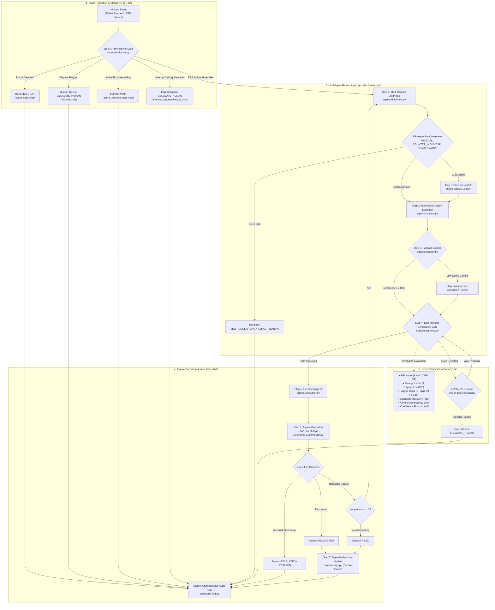
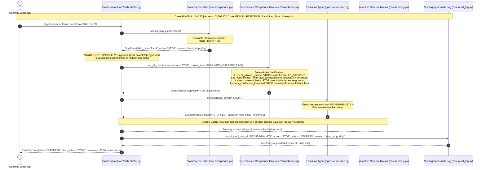

# Sentinel — Technical Architecture & Methodology Specification

**Track 3: AI Revenue Recovery — Razorpay AI Buildathon**

> **⚠️ ALL DATA IN THIS SYSTEM IS SIMULATED.**  
> All payment transactions, debtor records, and customer profiles are synthetically generated for demonstration and benchmarking purposes.

---

## 1. System Overview & Dual-Engine Scope

Sentinel is an autonomous, dual-engine AI revenue recovery architecture designed to address India's **₹8.1 Trillion MSME delayed payments crisis** (2025–26 Economic Survey). It resolves revenue leakage across two distinct temporal horizons:

1. **Failed Payments Engine (Intraday B2C/Checkout)**: Resolves high-velocity checkout failures (bank timeouts, gateway errors, auth expirations, insufficient funds) within minutes to hours.
2. **B2B Receivables Engine (Commercial Invoices)**: Manages overdue commercial invoices across weeks to months (administrative approval lag, working capital cash-flow mismatches, chronic delinquency, and disputes).

---

## 2. End-to-End Pipeline Architecture

### Full Case Lifecycle Flowchart

### Real Hard-Stop Sequence Diagram (Case `PAY-5fb8d16c-272`)

Sourced directly from live benchmark audit trail data in [`reports/payment_batch_breakdown.csv`](reports/payment_batch_breakdown.csv) and [`data/failed_payments.json`](data/failed_payments.json):

### The 5-Phase Execution Flow

1. **Detect (Step 0)**: Ingests transaction failure or overdue invoice events. Before any generative AI model is called, deterministic statutory rules in [`core/compliance.py#L292-L330`](core/compliance.py#L292-L330) verify whether the case is legally actionable, halting fraud, dispute, exhausted attempt, or active promise-to-pay cases.
2. **Diagnose (Step 1)**: Evaluates root cause using 3-sample multi-perspective self-consistency (`FACTUAL`, `COUNTER_INDICATOR`, `CONSERVATIVE`) in [`agents/diagnosis.py#L217-L279`](agents/diagnosis.py#L217-L279), arriving at an analytical diagnosis category and calibrated confidence score.
3. **Decide (Steps 2–3)**: Consumes historical outcome memory, debtor tier, and diagnostic cause to select a single recovery action from a strictly bounded domain menu in [`agents/strategy.py#L185-L270`](agents/strategy.py#L185-L270), with automatic fallback ladder step-down if confidence is low or signals conflict.
4. **Deterministic Gate (Step 4)**: The proposed action is intercepted and verified by plain Python code in [`core/compliance.py#L487-L558`](core/compliance.py#L487-L558) against RBI Fair Practices regulations and financial ceilings. If rejected, the agent re-proposes once under gate constraints before escalating to human queues.
5. **Execute & Audit (Steps 5–8)**: Dispatches recovery with atomic idempotency locks and 2 AM tool-failure retries in [`agents/execution.py#L65-L165`](agents/execution.py#L65-L165), updates Bayesian outcome memory in [`core/memory.py#L125-L175`](core/memory.py#L125-L175), and records a cryptographically auditable JSON trail in [`core/audit_log.py`](core/audit_log.py).

---

## 3. Shared Dual-Engine Pipeline: The Five Functions

Both **Failed Payments** (`FAILED_PAYMENT`) and **B2B Receivables** (`B2B_RECEIVABLE`) flow through an identical state machine. Domain differences are strictly confined to schema-guided prompt construction and bounded action-menu selection; the core orchestration, verification, and execution logic is never duplicated:

1. **`process_case()` in [`core/orchestrator.py#L134-L420`](core/orchestrator.py#L134-L420)**: Coordinates the case lifecycle — evaluating pre-pipeline skip conditions (fraud, disputes, attempt ceilings), orchestrating the multi-attempt adaptive retry loop (`AGENT_LOOP_MAX_ATTEMPTS = 3`), triggering re-proposals on gate rejection, applying fallback ladders, and managing terminal outcome states.
2. **`diagnose()` in [`agents/diagnosis.py#L217-L279`](agents/diagnosis.py#L217-L279)**: Performs multi-sample self-consistency diagnostic passes across distinct analytical perspectives (`FACTUAL`, `COUNTER_INDICATOR`, `CONSERVATIVE`) to classify root cause and compute calibrated consensus confidence.
3. **`propose_strategy()` in [`agents/strategy.py#L185-L270`](agents/strategy.py#L185-L270)**: Consumes the diagnosis, debtor/customer history, relationship tier, and historical memory statistics to propose exactly one compliant action from the domain-specific bounded menu.
4. **`run_all_checks()` in [`core/compliance.py#L487-L558`](core/compliance.py#L487-L558)**: Independently evaluates proposed actions against hard regulatory rules, statutory contact windows, attempt caps, concurrency locks, and confidence thresholds before any action is dispatched.
5. **`execute()` in [`agents/execution.py#L65-L165`](agents/execution.py#L65-L165)**: Dispatches the verified recovery action under atomic idempotency protection with exception safety, returning a structured execution result.

### Domain Parameterization Matrix

| Architectural Dimension | Failed Payments Vertical | B2B Receivables Vertical |
| :--- | :--- | :--- |
| **Case Schema** | `FailedPaymentCase` ([`core/schemas.py`](core/schemas.py)) | `B2BInvoiceCase` ([`core/schemas.py`](core/schemas.py)) |
| **Temporal Granularity** | Minutes to Hours (Intraday) | Days to Weeks (Commercial cycles) |
| **Primary Root Causes** | `BANK_TIMEOUT`, `INSUFFICIENT_FUNDS`, `AUTH_EXPIRED`, `GATEWAY_ERROR` | `ADMINISTRATIVE_DELAY`, `CASH_FLOW_MISMATCH`, `CHRONIC_DELINQUENCY`, `DISPUTED_INVOICE` |
| **Bounded Action Menu** | `RETRY_NOW`, `RETRY_LATER`, `SUGGEST_ALTERNATE_METHOD`, `ESCALATE_HUMAN`, `STOP` | `SEND_REMINDER`, `OFFER_PAYMENT_PLAN`, `ESCALATE_TONE`, `WAIT`, `ESCALATE_HUMAN`, `STOP` |
| **Statutory Attempt Ceiling** | 5 automated attempts (`MAX_ATTEMPTS_PAYMENT`) | 4 automated touchpoints (`MAX_ATTEMPTS_B2B`) |
| **Regulatory Contact Hours** | Exempt on non-contact technical retries; 8 AM–7 PM on contact | Strictly enforced (8:00 AM – 7:00 PM IST) |
| **Fatigue Cap Ceiling** | 2 consecutive attempts within 24h | 3 debtor touchpoints without response |
| **Minimum Value Threshold** | ₹500 (`MIN_RECOVERY_AMOUNT_PAYMENT`) | ₹5,000 (`MIN_RECOVERY_AMOUNT_B2B`) |

---

## 4. Multi-Perspective Self-Consistency & Confidence Gating

### Multi-Sample Diagnostic Consensus ([`agents/diagnosis.py#L217-L279`](agents/diagnosis.py#L217-L279))

Single-pass LLM prompts can hallucinate or vacillate when debtor data contains ambiguous signals. Sentinel implements an architectural multi-sample consensus mechanism:
- Every eligible case runs through three distinct prompt perspectives:
  1. `FACTUAL`: Evaluates hard failure codes, payment history metrics, and timestamp differences.
  2. `COUNTER_INDICATOR`: Actively searches for disconfirming signals (e.g., whether a recent customer complaint undermines an apparent network error).
  3. `CONSERVATIVE`: Assumes adverse intent or liquidity insolvency when ambiguity arises.

### Calibrated Consensus Decision Rules

1. **Unanimous Consensus (3/3 samples agree)**:  
   High agreement indicates clear root cause. The majority category is adopted, and confidence retains full consensus weight ($\ge 0.85$, typically $0.88–0.95$). Verified in [`tests/test_diagnosis_self_consistency.py`](tests/test_diagnosis_self_consistency.py).
2. **Majority Consensus (2/3 samples agree)**:  
   A dissenting sample indicates genuine underlying ambiguity. Sentinel adopts the majority category but applies **calibrated confidence decay, strictly capping confidence at 0.80**. Because $0.80 < 0.85$, this automatically triggers the Fallback Ladder and the Deterministic Confidence Gate to escalate safely rather than risk an aggressive, ungrounded action. Verified in [`tests/test_diagnosis_self_consistency.py`](tests/test_diagnosis_self_consistency.py).
3. **Split Vote (1/1/1 disagreement)**:  
   Total divergence across perspectives. Sentinel classifies root cause as `UNKNOWN`, assigns default low confidence ($0.50$), logs `SELF_CONSISTENCY_DISAGREEMENT`, and immediately stands down to human operations. Verified in [`tests/test_diagnosis_self_consistency.py`](tests/test_diagnosis_self_consistency.py).

### Independent Gate Backstop (`check_confidence_threshold` in [`core/compliance.py#L440-L480`](core/compliance.py#L440-L480))

Even if an unvalidated caller or malformed strategy prompt bypasses the Strategy Agent's internal soft fallback ladder, the Deterministic Compliance Gate independently evaluates:
$$\text{confidence} \ge \text{config.CONFIDENCE\_THRESHOLD}\quad (0.85)$$
If sub-threshold, the gate independently rejects the action with `LOW_CONFIDENCE_BLOCKED` and routes directly to the human operations queue. Safe passive actions (`ESCALATE_HUMAN`, `STOP`, `WAIT`) remain exempt, ensuring the system can always stand down safely (verified in [`tests/test_failure_modes.py#L125-L199`](tests/test_failure_modes.py#L125-L199)).

---

## 5. Where We Chose Not to Use AI

In an autonomous financial recovery engine, utilizing generative AI for deterministic constraints creates unacceptable operational, financial, and regulatory risk. Sentinel explicitly restricts generative LLMs to genuine ambiguity (identifying root causes from noisy signals and calibrating conversational/strategy tone), while enforcing all boundaries through deterministic, non-AI code:

### 1. The Hard-Rule Compliance Gate ([`core/compliance.py#L487-L558`](core/compliance.py#L487-L558))
Statutory boundaries — including RBI contact-hour windows (8 AM – 7 PM IST), attempt ceilings (5 for payments, 4 for B2B), and mandatory dispute/fraud halts — are implemented in pure deterministic Python. Legal compliance must be an unbendable invariant rather than a probabilistic LLM prediction subject to prompt drift, jailbreaking, or hallucination.

### 2. The Idempotency & Concurrency Lock ([`core/compliance.py#L332-L375`](core/compliance.py#L332-L375) / [`core/audit_log.py`](core/audit_log.py))
Atomic reservation state is protected under re-entrant threading locks (`threading.Lock`) before execution. Preventing double-debiting and duplicate debtor communications during near-simultaneous webhook retries requires strict transactional atomicity that probabilistic language models cannot guarantee (verified in [`tests/test_failure_modes.py#L242-L335`](tests/test_failure_modes.py#L242-L335)).

### 3. The Win-Rate Statistics Tracker ([`core/memory.py#L125-L175`](core/memory.py#L125-L175))
Historical strategy performance and category success rates are tracked via Bayesian arithmetic and deterministic sliding windows. Injected memory context must represent mathematical empirical truth rather than model-generated summaries of past performance.

### 4. Deterministic Confidence-Threshold Enforcement ([`core/compliance.py#L440-L480`](core/compliance.py#L440-L480))
The `0.85` regulatory confidence threshold (sourced directly from [`config/rules_config.json`](config/rules_config.json)) is evaluated as an independent, deterministic gate check on the AI-produced confidence score. This ensures that the decision of whether a proposal clears the safety floor is an immutable architectural backstop rather than an AI decision left to the model itself.

---

## 6. RBI Fair Practices Code Grounding

Sentinel’s B2B compliance rules are mathematically grounded in the **Reserve Bank of India (RBI) Fair Practices Code for Lenders & Recovery Agents**:

* **Contact Hours Window (8:00 AM – 7:00 PM IST)**: Outbound debtor contact (`SEND_REMINDER`, `ESCALATE_TONE`) is strictly blocked outside reasonable business hours. Internal safe escalations (`ESCALATE_HUMAN`) and standby actions (`WAIT`) are permitted 24/7.
* **Debtor Dispute Invariant**: Active disputes immediately halt automated collections and route the invoice to human dispute resolution teams with reason code `dispute_skip`.
* **Zero-Harassment Attempt Caps**:
  * Failed Payments: Ceiling of 5 automated attempts.
  * B2B Receivables: Ceiling of 4 automated contact touchpoints.
* **No Intimidating Tone**: The Strategy Agent's tone modulation is bounded across 4 calibrated levels (`POLITE`, `FIRM`, `URGENT`, `ESCALATED`) with strict prohibitions against threatening, abusive, or coercive language.
* **Promise-to-Pay Lifecycle Tracking**: Unexpired promises-to-pay (`WAIT`) pause all recovery communications until the promised settlement date, preventing premature or harassing reminders.

---

## 7. Defense-in-Depth & 2 AM Tool Resilience

1. **Soft Fallback Ladder**: If the Strategy Agent's confidence falls below `0.85`, the system steps down from aggressive actions to conservative interventions (`ESCALATE_HUMAN` or `SUGGEST_ALTERNATE_METHOD`), refusing to gamble on low-certainty proposals.
2. **Conflicting Signal Resolution**: When disparate data sources disagree (e.g. Risk Engine indicates low risk, but Support Ticket requests Do-Not-Contact), the Fallback Ladder halts automated retries and escalates to human review.
3. **2 AM Tool Outage Resilience**: Simulated downstream rail failures (e.g. 503 Gateway Outages) trigger an automated 1-retry dispatch under exception handling. If the rail remains down, Sentinel logs the incident in the audit trail and fails gracefully without crashing worker threads.
4. **Thread-Safe Atomic Idempotency**: Pre-execution atomic reservation prevents concurrent race conditions across distributed worker processes.

---

## 8. Adaptive Memory & Bayesian Context Injection

* **Double-Gated Recording**: Only genuine recovery actions (`RETRY_NOW`, `RETRY_LATER`, `SUGGEST_ALTERNATE_METHOD`, `SEND_REMINDER`, `OFFER_PAYMENT_PLAN`, `ESCALATE_TONE`) that yield terminal outcomes (`SUCCESS` or `FAILED`) update historical weights. Routing actions (`STOP`, `ESCALATE_HUMAN`, `WAIT`) are excluded.
* **Recency Weighting**: Rolling 20-attempt window with exponential decay ($w_i = 1.1^i$) ensures current railway health heavily outweighs stale history.
* **Cold-Start Neutrality**: Returns a neutral `0.50` prior when zero historical samples exist, preventing premature action starvation.
* **Live LLM Prompt Injection**: Measured success rates per `(diagnosis_category, action)` pair are formatted and injected as dynamic context into strategy generation prompts via [`agents/strategy.py#L90-L106`](agents/strategy.py#L90-L106), allowing live reasoning models (Google Gemini) to adapt strategy proposals based on measured recovery performance.

---

## 9. Benchmark Methodology & Reproducibility

* **Symmetric Operational Budgets**: Both the Naive Baseline and the AI Recovery Agent receive identical 3-attempt execution budgets (`AGENT_LOOP_MAX_ATTEMPTS = 3`).
* **Permanent Simulation Anchor**: All invoice age calculations (`days_overdue`) and contact-hour evaluations are anchored to [`config.SIMULATED_CURRENT_TIME = datetime(2026, 8, 24, 12, 0, 0) IST`](core/config.py#L73-L79), preventing wall-clock test drift (verified in [`tests/test_baseline.py`](tests/test_baseline.py)).
* **Structural RNG Isolation**: All simulation random draws accept an explicit `rng` parameter, isolating benchmark execution from unit test suites and mock simulations.
* **Shared Probability Tables**: Identical underlying success probability matrices are used for both baseline and AI agents (`config.PAYMENT_RETRY_SUCCESS_PROB` and `config.B2B_REMINDER_SUCCESS_PROB`). The AI agent wins purely through accurate root-cause diagnosis and optimal action selection, never through inflated simulation odds.

---

## 10. Scope & Generalization

Sentinel's benchmark evaluation is conducted across **N=80 synthetic validation cases** (30 Failed Payments, 50 B2B Receivables). We make **no statistical generalization claim** from this sample size: the 30.0% full-batch and 35.8% addressable recovery rates demonstrate pipeline mechanics on this synthetic set rather than a statistically valid claim over the infinite distribution of Indian commerce.

Robustness to unseen and out-of-distribution inputs in Sentinel is fundamentally **architectural, not statistical**:
1. **Schema Validation Layer ([`core/schemas.py`](core/schemas.py))**: Input serialization rigidly enforces typed dataclasses and enumeration bounds. Unknown category codes (such as unrecognized failure codes or invalid case types) and non-positive monetary balances (`amount <= 0`) are cleanly rejected at ingestion rather than entering agent reasoning.
2. **Low-Confidence Escalation ([`core/compliance.py`](core/compliance.py))**: Out-of-distribution feature combinations induce low model confidence or multi-perspective disagreement, automatically capping confidence below the regulatory threshold ($< 0.85$) and triggering safe fallback escalation to human teams.
3. **Bounded-Action Deterministic Gate ([`core/compliance.py`](core/compliance.py))**: Even when reasoning agents operate under complete ambiguity, the compliance gate enforces rigid statutory invariants (RBI contact hours, attempt ceilings, fatigue caps, and dispute halts), ensuring the system cannot execute ungrounded, abusive, or dangerous actions on novel cases.

Rather than relying on an unqualified claim of hypothetical resilience, this architecture was actively tested against failure: when [`tests/test_out_of_distribution.py`](tests/test_out_of_distribution.py) was executed against the full pipeline, it surfaced a genuine architectural gap — negative case amounts (`-₹1,500.0`) evaluated as `< 500` in `check_cost_threshold()`, misclassifying them as cheap sub-threshold micro-cases and routing them to automated `RETRY_NOW`. We resolved this gap at its root by adding strict non-positive amount rejection (`amount <= 0` raises `ValueError`) at schema construction in [`core/schemas.py`](core/schemas.py), backed by a defensive gate guard in [`core/compliance.py`](core/compliance.py) that routes any bypassed non-positive balance to `ESCALATE_HUMAN` (`INVALID_AMOUNT_ESCALATED`). With this real gap fixed, all 3 OOD scenarios (novel failure code tuples, extreme positive and negative amounts, and unknown case types) now pass cleanly across the 150-test suite.

Furthermore, all governance thresholds across the system — including confidence safety floors (`0.85`), loop caps (`3`), attempt ceilings (`5` for payments, `4` for B2B), and contact hours (`8 AM – 7 PM IST`) — are **illustrative engineering defaults**, not calibrated against real-world payment data.

A real-world production deployment would require an integrated live fraud and dispute signal source (e.g. Razorpay Thirdwatch, card network dispute feeds) and empirical threshold recalibration against real-world recovery outcomes.

*(Cross-referenced with [`Where We Chose Not to Use AI`](#5-where-we-chose-not-to-use-ai) and [`README.md § Scope & Generalization`](README.md#scope-generalization).)*

---

## 11. Production Roadmap (Buildathon Scope Boundaries)

Sentinel is architecturally complete for buildathon evaluation. The following represent production transition steps:

* **Async Worker Integration**: Replace sequential loops with distributed Celery/FastAPI workers backed by Redis queue brokers.
* **Live Gateway Webhooks**: Replace `agents/execution.py` simulation tables with live Razorpay Payments API and WhatsApp/SMS webhook integrations.
* **Distributed State Store**: Migrate JSON memory and audit logs to PostgreSQL / CockroachDB with row-level transactional locks.
