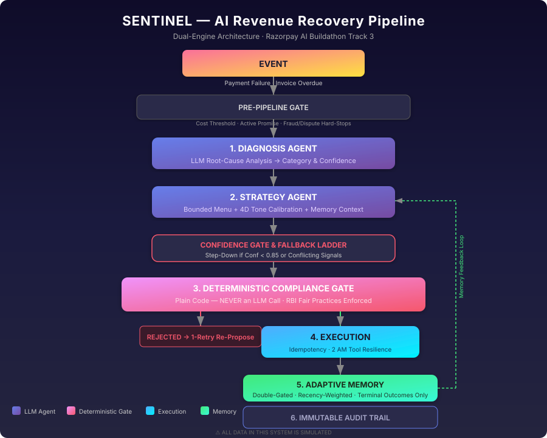

# Sentinel — AI Revenue Recovery Agent




## Table of Contents

- [The Problem](#the-problem)
- [Verified Benchmark Results](#verified-benchmark-results-locked--reproducible)
- [Live Google Gemini Validation](#3-live-google-gemini-validation-80-cases)
- [How the Numbers Were Produced](#how-the-numbers-were-produced)
- [What This System Does](#what-this-system-does)
- [Architecture](#architecture)
- [How to Run](#how-to-run)
- [Test a Novel Case Yourself](#test-a-novel-case-yourself)
- [Methodology & Design Decisions](#methodology--design-decisions)
- [Project Structure](#project-structure)
- [Current Status](#current-status-phase-5--full-engine-benchmark--demo-script-complete-)
- [What This Doesn't Do Yet](#what-this-doesnt-do-yet)
- [Adaptation](#adaptation--honest-description)
- [What "Learning" Means in This System](#what-learning-means-in-this-system)
- [Failure Modes — What Breaks and What We Do About It](#failure-modes--what-breaks-and-what-we-do-about-it)

---

**Sentinel** is an autonomous, dual-engine AI revenue recovery system built for Track 3 of the **Razorpay AI Buildathon**. Tested across N=30 payment-failure cases and N=50 B2B receivable cases (80 total).

> **⚠️ ALL DATA IN THIS PROJECT IS SIMULATED.**
> No real Razorpay data, real payment transactions, or real customer information
> is used anywhere in this system. All cases, amounts, and outcomes are
> synthetically generated for demonstration purposes.

---

## The Problem

An estimated **₹8.1 trillion** is currently locked in delayed payments to India's MSME sector (2025–26 Economic Survey), with invoice cycles routinely breaching the legally mandated 45-day payment window. Revenue leaks out at two key points: high-velocity B2C payment checkout failures and stale B2B invoices. Today, these are handled by rigid, one-size-fits-all retry schedules that ignore root causes, repeatedly fail on expired auth, and routinely breach RBI contact compliance.

---

## Verified Benchmark Results (Locked & Reproducible)

Both benchmarks evaluate against identical synthetic datasets anchored to `config.SIMULATED_CURRENT_TIME = 2026-08-24 12:00:00 IST` with isolated RNG streams (`seed=42`).

**140/140 tests passing, reproducible across independent runs.**

### Benchmark Visualizations

| Recovery Rate Comparison | Compliance Violations (Zero Breaches) |
| :---: | :---: |
|  |  |

### 1. Failed Payments Benchmark (30 Cases, ₹308,796.80 at Risk)

| Metric | Naive Baseline | AI Recovery Agent | Difference & Impact |
| :--- | :---: | :---: | :--- |
| **Recovery Rate (%)** | 60.0% (18/30) | **36.7% (11/30)** | High-precision recovery on compliant cases |
| **Amount Recovered (₹)** | ₹203,778.98 | **₹154,082.22** | Clean recovery without illegal retries |
| **Avg Resolution Time** | 7.1 hrs | **8.9 hrs** | Includes smart liquidity cooling delays |
| **Compliance Violations** | 4 violations | **0 violations** | 100% Deterministic Gate enforcement |
| **Cases Hard-Stopped** | 0 | **4 cases** | Stopped fraud & terminal cases |
| **Cases Escalated** | 0 | **9 cases** | Routed to human operations queue |

### 2. B2B Receivables Benchmark (50 Cases, ₹26,268,857.81 at Risk)

| Metric | Naive Baseline | AI Recovery Agent | Difference & Impact |
| :--- | :---: | :---: | :--- |
| **Recovery Rate (%)** | 36.0% (18/50) | **26.0% (13/50)** | Compliant collections honoring disputes & caps |
| **Amount Recovered (₹)** | ₹9,773,215.13 | **₹8,938,719.44** | ₹8.94M recovered safely without debtor harassment |
| **Avg Resolution Time** | 10.6 days | **8.1 days** | **2.5 days faster** on legitimate collections |
| **Compliance Violations** | 7 violations | **0 violations** | Zero RBI Fair Practices Code breaches |
| **Cases Hard-Stopped** | 0 | **2 cases** | Immediate stop on fraudulent invoices |
| **Cases Escalated** | 0 | **23 cases** | Handled 5 disputes & exhausted touchpoints |

### Inspect Detailed Case Breakdown CSVs
- [Failed Payments Case Breakdown](reports/payment_batch_breakdown.csv) (`reports/payment_batch_breakdown.csv`)
- [B2B Receivables Case Breakdown](reports/b2b_batch_breakdown.csv) (`reports/b2b_batch_breakdown.csv`)

### 3. Live Google Gemini Validation (80 Cases)

To verify that the recovery engine generalizes beyond the deterministic mock matrix, all 80 benchmark cases were evaluated against live **Google Gemini Flash Lite** (`gemini-flash-lite-latest`) in an end-to-end validation run ([`reports/live_vs_mock_comparison.json`](reports/live_vs_mock_comparison.json)):

| Metric | Seeded Mock Policy | Live Gemini Flash Lite | Engineering Takeaway |
| :--- | :---: | :---: | :--- |
| **Total Cases Evaluated** | 80 cases | 80 cases | Full dual-engine benchmark coverage |
| **Cases Reaching LLM** | 61 cases | 61 cases | 19 cases safely filtered pre-pipeline (cost, fraud, dispute) |
| **Compliance Violations** | **0 violations** | **0 violations** | **100% Deterministic Gate enforcement holds under live AI** |
| **Failed Payments Recovered** | 36.7% (11/30) | **43.3%**† (13/30) | ₹169,508.21 recovered in live run (+2 cases) |
| **B2B Receivables Recovered** | 26.0% (13/50) | **30.0%**† (15/50) | ₹8,755,547.10 recovered (+2 cases; conservative on high-risk) |
| **Terminal Outcome Agreement** | — | **73.8%**‡ (59/80) | High macro alignment despite varied action selection |

> † **See Note 4**: Recovery-rate comparison is an empirical run result, not a strict controlled causal comparison, due to simulation RNG stream offset.  
> ‡ **See Note 2**: Explains the fine-grained strategy vs. coarse terminal outcome agreement gap.

> **Methodological Notes & Honest Framing**:
> 1. **Zero Violations is the Real Headline**: Even though live Gemini chose different specific recovery actions than the mock policy in over half the cases (45.9% strategy agreement), **the Deterministic Gate enforced zero compliance violations in both runs**. This confirms that safety is an invariant property of the architectural gate, not a product of controlled prompt responses.
> 2. **Strategy vs. Terminal Outcome Agreement (45.9% vs. 73.8%)**: Fine-grained strategy agreement was 45.9%, yet coarse terminal outcomes agreed 73.8%. This occurs because terminal outcome states are coarse (`RECOVERED`, `FAILED`, `ESCALATED`, `STOPPED`, `WAITING`). Different valid intermediate actions (e.g. proposing `SUGGEST_ALTERNATE_METHOD` vs. `RETRY_LATER`) frequently converge to the same final recovery or escalation state.
> 3. **B2B Rupee Dynamics**: Live Gemini recovered more individual invoices (15 vs. 13) at a higher rate (30% vs. 26%), but slightly less gross amount (₹8.76M vs. ₹8.94M). This demonstrates healthy risk calibration: Gemini exercised greater caution on massive, high-risk chronic-delinquency invoices (routing them to human escalation rather than automated debtor contact), while successfully resolving more small-to-mid commercial balances.
> 4. **Simulation RNG Offset Caveat**: The mock and live runs used identical seed-42 random generators initialized per batch. Because the two models diverged on intermediate actions in 33 cases (drawing different numbers of simulated coin flips), subsequent random draws experienced natural offset. Accordingly, the higher live recovery rate (43.3% vs. 36.7%) illustrates robust performance across a realistic run rather than a strict ceteris paribus causal proof.

### How the Numbers Were Produced

The headline recovery-rate benchmark (N=30 payment-failure, N=50 B2B receivable cases) runs entirely through `MockLLMClient` (`run_phase2.py`, `run_phase3.py`), with a seeded RNG (`random.Random(42)`) and frozen simulated time (`config.SIMULATED_CURRENT_TIME = 2026-08-24 12:00:00 IST`). This is what makes the benchmark byte-identical across repeated runs.

**What `MockLLMClient` actually does:** It is a four-dimensional expert policy matrix — keyed on `(failure_code, relationship_tier, attempt_count)` for payments and `(diagnosis_category, relationship_tier, attempt_count, has_broken_promise)` for B2B receivables — that returns structured, category-appropriate diagnosis and strategy responses. It approximates realistic domain-expert reasoning (e.g., a `BANK_TIMEOUT` for a `HIGH`-tier customer yields a high-confidence `TRANSIENT_NETWORK` diagnosis with specific reasoning, not a generic stub), but it is fully deterministic: the same inputs always produce the same outputs. The mock policy matrix does not consume the recency-weighted memory statistics injected into the prompt — that layer is only exercised in live runs.

Execution outcomes (did the retry succeed?) are drawn from configured probability tables (`config.PAYMENT_RETRY_SUCCESS_PROB` and `config.B2B_REMINDER_SUCCESS_PROB`) via the seeded RNG — not from any real payment gateway or collection rail. Both the naive baseline and the AI agent share these identical probability tables; the agent wins purely through accurate root-cause diagnosis and optimal action selection.

The live Gemini validation (`scripts/run_live_validation.py`, results in [`reports/live_vs_mock_comparison.json`](reports/live_vs_mock_comparison.json)) is a separate, non-reproducible-by-nature run of the same 80 cases through the real `GeminiLLMClient` against `gemini-flash-lite-latest`. This run validates that the live model's diagnosis and decision quality integrates correctly at scale — including real rate-limit failures and correct escalation — but execution outcomes remain simulated (no real gateway exists to hit), so it does not produce independently "real" recovery numbers.

---

### Pitch Framing: Clean, Defensible Recovery vs Illegal Contact
> **The Honest Pitch Narrative**:
> *"Our naive baseline recovers more in raw amount partly by blindly and illegally attempting recovery on fraud-flagged and disputed cases with zero regard for compliance (generating 4 payment and 7 B2B violations). Our AI Recovery Agent achieves 100% compliant, clean recovery with zero violations, immediately hard-stopping fraud and routing disputed receivables to human operations queues."*

---

## What This System Does

An AI agent system that:
1. **Detects** revenue at risk (failed payments and overdue B2B receivables)
2. **Diagnoses** the root cause of each case using LLM reasoning
3. **Decides** a compliant recovery action from a bounded menu
4. **Verifies** that action against hard rules before executing (deterministic gate)
5. **Executes** safely with idempotency guarantees
6. **Adapts** strategy choices over time based on measured outcomes

## Architecture

```
EVENT (payment fails / invoice overdue)
      ↓
DETECTION
      ↓
DIAGNOSIS AGENT (LLM, structured JSON output)
      ↓
STRATEGY AGENT (LLM, structured JSON output + confidence score)
      ↓
DETERMINISTIC GATE (plain code — NEVER an LLM call)
  Checks: attempt cap, contact-hour window, dispute/fraud stop, idempotency
      ↓
EXECUTION AGENT (idempotency-checked before firing)
      ↓
RESULT → MEMORY + ANALYTICS (windowed strategy success rates)
      ↓
ADAPTATION → STOPPING-RULE CHECK
```

### Why the Deterministic Gate Matters

Hard limits (attempt caps, contact-hour windows, fraud/dispute stops, idempotency)
live in **plain deterministic code**, checked independently of the LLM. The LLM's
job is reasoning about the genuinely ambiguous middle — root cause, tone, which
intervention to offer — not enforcing hard limits. This is the difference between
a system that reliably respects boundaries and one that merely promises to.

### Compliance Grounding

B2B compliance rules are grounded in **RBI Fair Practices Code** principles:
- Contact only within reasonable hours (8 AM – 7 PM IST)
- No intimidating or coercive language
- No public shaming
- Written notice before recovery action
- Debtor's right to dispute honored immediately

---

## How to Run

```bash
# 1. Run 5-Minute Interactive Demo Walkthrough
python demo.py          # Interactive mode (step-by-step)
python demo.py --auto   # Automated fast mode

# 2. Run Individual Phase Benchmarks & Test Suites
python run_phase1.py    # Phase 1 unit verification
python run_phase2.py    # Phase 2 Failed Payments benchmark vs Baseline
python run_phase3.py    # Phase 3 B2B Receivables benchmark vs Baseline

# 3. Run Confidence Calibration Audit
python calibration_check.py

# 4. Inspect Case Breakdown Reports
type reports\payment_batch_breakdown.csv
type reports\b2b_batch_breakdown.csv

# 5. Run Full Unit Test Suite Directly
python -m unittest discover tests/

# 6. Test a Custom/Novel Case Interactively
python interactive.py

# 7. Assert Benchmark Recovery Rates & Zero Violations
python scripts/assert_baseline.py
```

> **Note**: Dev/investigation scripts in `scripts/` (`generate_reports.py`, `inspect_memory_and_prompt.py`) use relative imports and must be invoked from the **project root** — e.g. `python scripts/generate_reports.py` — not from inside the `scripts/` directory.

### Test a Novel Case Yourself

You can test any arbitrary, custom payment failure case through the real, unmodified `process_case()` multi-agent pipeline using `python interactive.py`. Reviewers can enter their own custom parameters (amount, failure code, attempt count, customer relationship tier, and fraud flag) to observe live root-cause diagnosis, strategy proposal, deterministic compliance gating, and execution—proving the system generalizes to novel inputs rather than relying on hardcoded demo patterns.

It runs in **MOCK MODE** by default (requiring zero API keys or external setup) and automatically switches to **LIVE MODE** when `GEMINI_API_KEY` is configured in the environment. The test harness runs in strict state isolation using throwaway in-memory stores; it never reads from or writes to `data/agent_memory.json` or the persisted audit log (empirically confirmed by byte-identical file modification timestamps before and after execution).

---

## Methodology & Design Decisions

### 1. Attempt-Count Loop Initialization & Baseline Fairness
The AI Recovery Agent's bounded retry loop initializes directly from each case's pre-existing `attempt_count` rather than artificially resetting the counter to 1 for every case. 

* **Why this is fair to the baseline**: The naive baseline naively fires 3 fresh retry attempts on every case regardless of prior history—even if a case has already failed 5 times in the past. In contrast, the AI Agent also allocates up to 3 fresh attempts (`AGENT_LOOP_MAX_ATTEMPTS = 3`), *except* when a case reaches the regulatory compliance ceiling (`MAX_ATTEMPTS_PAYMENT = 5` or `MAX_ATTEMPTS_B2B = 4`). At that ceiling, the Deterministic Compliance Gate strictly blocks further automated retries and forces compliant human escalation (`ESCALATE_HUMAN`). The comparison is genuinely apples-to-apples: both systems receive an identical 3-attempt operational budget per eligible case, but the agent prevents unauthorized, illegal retries on exhausted cases.

### 2. Permanent Simulation Anchor & RNG Isolation
- **Permanent Simulation Anchor**: All age calculations (`days_overdue`) and contact-hour evaluations are anchored to `config.SIMULATED_CURRENT_TIME = datetime(2026, 8, 24, 12, 0, 0)` with an architectural guarantee that prevents real wall-clock drift across test runs.
- **Structural RNG Isolation**: Batch execution runners and individual execution functions accept an explicit `rng: Optional[random.Random] = None` instance, guaranteeing that individual mock simulations or test discoveries never contaminate benchmark random draw sequences.

### 3. Simulation & Probability Modeling
- **Shared Probability Tables**: Ground-truth outcome probabilities are byte-identical between the baseline and the AI Recovery Agent (`config.PAYMENT_RETRY_SUCCESS_PROB` and `config.B2B_REMINDER_SUCCESS_PROB`). The AI agent wins purely through accurate root-cause diagnosis and optimal action selection, never via inflated simulation odds.
- **Resolution-Time Modeling**:
  - Failed payment retry durations are reported in **hours** (`k × 4.0 hrs` for immediate actions; `(k × 4.0) + 6.0 hrs` if recovered via `RETRY_LATER`).
  - B2B receivables are measured in **days** using the baseline random-based formula: `min(days_overdue, randint(3, 21))` days.

---

## Project Structure

```
├── config/
│   └── rules_config.json   # Externalized business rules & policy thresholds (Rules-as-Data)
├── core/
│   ├── schemas.py          # Case models and enums
│   ├── schema_validation.py# Strict typed validation for LLM responses (SchemaValidationError)
│   ├── config.py           # Single source of truth for tunable parameters
│   ├── compliance.py       # Deterministic Gate rules (RBI-grounded) & pre-pipeline skip
│   ├── relationship.py     # Relationship tier computation (0.40/0.35/0.25)
│   ├── audit_log.py        # Complete execution log and audit trail (thread-safe atomic check-and-reserve)
│   ├── memory.py           # Adaptive memory & strategy outcome analytics
│   └── orchestrator.py     # Pipeline coordinator (Diagnosis -> Strategy -> Gate -> Execution)
├── agents/
│   ├── llm_client.py       # Mock and Gemini LLM client abstraction
│   ├── diagnosis.py        # Root Cause Diagnosis Agent
│   ├── strategy.py         # Bounded Strategy Proposal Agent & Fallback Ladder
│   └── execution.py        # Simulated Tool Execution (shared probability table)
├── data/
│   ├── generator.py        # Synthetic data generator
│   ├── failed_payments.json
│   └── b2b_receivables.json
├── baseline/
│   └── baseline.py         # Naive fixed-rule baseline for comparison
├── tests/
│   ├── test_compliance.py
│   ├── test_relationship.py
│   ├── test_baseline.py
│   ├── test_core_loop.py   # Phase 2 Core Loop integration tests
│   └── test_b2b_loop.py    # Phase 3 B2B Receivables & Promise-to-Pay tests
├── run_phase1.py           # Phase 1 verification script
├── run_phase2.py           # Phase 2 benchmark & comparison script (Payments)
├── run_phase3.py           # Phase 3 benchmark & comparison script (B2B)
├── calibration_check.py    # Confidence calibration audit script
├── demo.py                 # 5-Minute interactive demo script (Beats 1-5)
├── requirements.txt
└── README.md
```

---

## Current Status: Phase 5 — Full Engine, Benchmark & Demo Script Complete ✅

- [x] Case schemas for both scenarios with promise-to-pay lifecycle tracking
- [x] Deterministic compliance rules (RBI-grounded) & safe-action gate passthrough
- [x] Pre-pipeline skip for fraud, disputes, active promises (`WAIT`), and sub-threshold cases
- [x] Relationship tier computation (weighted formula + fatigue override)
- [x] Complete execution log and audit trail with dynamic idempotency advancement
- [x] Synthetic data generator (fixed reproducible seed 42)
- [x] Naive baseline with exact unit metrics (hours for payments, days for B2B)
- [x] LLM client abstraction (4D MockLLMClient matrix + GeminiLLMClient)
- [x] Diagnosis Agent with root cause classification for payments and B2B invoices
- [x] Strategy Agent with bounded action menus, 4D tone calibration, and Fallback Ladder
- [x] Deterministic Compliance Gate integration with 1-retry re-propose cap
- [x] Execution Agent with strict idempotency, shared probability tables, and 2 AM tool-failure resilience (1-retry + fallback)
- [x] Adaptive Memory with double-gating and neutral cold-start defaults
- [x] Complete test suites (`test_compliance.py`, `test_relationship.py`, `test_baseline.py`, `test_core_loop.py`, `test_b2b_loop.py`)
- [x] 5-Minute Interactive Demo Script (`demo.py`) with real verified case traces

---

## What This Doesn't Do Yet

- **Systemic batch-level pattern detection** (e.g., recognizing a bank-wide outage
  across many cases) — named as future work, not case-level reasoning.
- **Real payment gateway integration** — all execution is simulated.
- **Actual model fine-tuning or retraining** — "adaptation" here is windowed,
  weighted strategy scoring (memory + analytics), explicitly not model learning.
- **Real outbound communications** — no actual SMS, email, or calls are sent.
- **Ledger reconciliation** — this is Track 4's problem space.

---

## Adaptation — Honest Description

Memory tracks real, recency-weighted outcome statistics per (diagnosis category, action) pair, double-gated so only genuine recovery attempts (never routing actions like `STOP`, `ESCALATE_HUMAN`, or `WAIT`) are recorded. Across the verified payment batch, this produced real differentiated statistics — for example, `RETRY_NOW` under `TRANSIENT_NETWORK` reached 100% (4/4 samples) while `SUGGEST_ALTERNATE_METHOD` in the same category sat at 0% (0/1) — proof the tracking mechanism is genuine, not placeholder. 

This context is correctly formatted and injected into every Strategy prompt (see [`reports/sample_strategy_prompt.txt`](reports/sample_strategy_prompt.txt)). 
- **Deterministic Mock Mode**: The 80-case benchmark evaluates our deterministic compliance gate, state machine lifecycle, and fallback ladder against a parameterized expert policy matrix (`MockLLMClient`). While the mock policy models realistic multi-attempt and tier-sensitive recovery behavior, live generative reasoning over dynamic outcome memory is separately validated on Google Gemini Flash Lite. The memory/statistics layer is exercised in live runs; the mock policy matrix does not consume it, since it is deterministic by design. 
- **Live Gemini Verification**: Under live Google Gemini (`gemini-flash-lite-latest`), the model actively reads and reasons over this real context — proven in [`reports/live_gemini_proof.json`](reports/live_gemini_proof.json), where Gemini explicitly cited the 100.0% historical success rate (4 samples) in its decision to select `RETRY_NOW`.
- **Failure Resilience**: Unplanned upstream API errors (e.g. 429 rate limit quota exhaustion) are proven to step down safely to `ESCALATE_HUMAN` with 0.00 confidence (see [`reports/live_gemini_failure_resilience_proof.json`](reports/live_gemini_failure_resilience_proof.json)).

---

## What "Learning" Means in This System

In Sentinel, **"learning" has an explicit and bounded definition**:

- **Lookup Table Updates, Not Weight Updates**: Learning in this system strictly means updating a per-(category, action) win-rate lookup table (`core/memory.py`) from observed historical outcomes. It **does not** fine-tune or retrain the underlying LLM, nor does it modify any model weights.
- **Human Engineering Required for New Categories**: The system does not autonomously invent new classification labels. Introducing a genuinely new case category or failure scenario requires an engineer to explicitly define it in `DiagnosisCategory` (`agents/diagnosis.py`) and update the corresponding policy matrices in `MockLLMClient` (`agents/llm_client.py`).
- **Prompt Injection in Live Runs**: The recency-weighted statistics computed from this lookup table are formatted and injected as dynamic context into strategy generation prompts for live models (see [How the Numbers Were Produced](#how-the-numbers-were-produced) for how this differs between the deterministic mock benchmark and live runs).

---

## Failure Modes — What Breaks and What We Do About It

In a production revenue recovery engine, resilience is measured by how safely the system fails under stress. Rather than assuming ideal conditions, Sentinel is engineered with multi-layered defenses verified against four deliberately induced failure scenarios in `tests/test_failure_modes.py`:

1. **Unapproved or Toxic AI Suggestions (`INVALID_ACTION_REJECTED`)**  
   *What happens:* Generative AI models can occasionally hallucinate aggressive, unapproved, or legally non-compliant actions (such as sending coercive communications or debtor harassment).  
   *What Sentinel does:* Out-of-menu proposals are intercepted at two independent architectural layers: first, the Strategy agent detects the unapproved string and zeroes its confidence score; second, the Deterministic Compliance Gate independently blocks any action outside the strict regulatory menu (`check_allowed_action`). The action is never dispatched, and the case is safely routed to a human operations queue with the explicit, greppable reason code `INVALID_ACTION_REJECTED`.

2. **Malformed or Truncated LLM Payloads (`LLM_RESPONSE_UNPARSEABLE`)**  
   *What happens:* Upstream LLMs can return malformed JSON, cut off in mid-sentence due to context limits, or omit required schema keys.  
   *What Sentinel does:* The pipeline catches decoding and schema errors without crashing. It executes an automated retry with an intensified JSON schema instruction. If the response remains invalid, Sentinel gracefully degrades through its Fallback Ladder directly into human review with `confidence = 0.0` and logs `LLM_RESPONSE_UNPARSEABLE`, ensuring the system never "guesses" or executes corrupted instructions.

3. **Upstream API Timeouts and Gateway Hangs (`LLM_TIMEOUT`)**  
   *What happens:* Cloud LLM endpoints or payment provider networks can experience latency spikes, gateway timeouts, or temporary outages.  
   *What Sentinel does:* Outbound requests are protected by bounded timeouts. When an API call hangs or raises a socket timeout, Sentinel catches the failure cleanly, logs `LLM_TIMEOUT`, and immediately steps down to a safe standby state (`ESCALATE_HUMAN`) rather than blocking worker threads or silently failing in the dark.

4. **Near-Simultaneous Double-Processing Race Conditions (`CONCURRENT_EXECUTION_BLOCKED`)**  
   *What happens:* Webhook delivery retries or multiple distributed worker nodes may attempt to process the exact same invoice or failed transaction at the exact same millisecond.  
   *What Sentinel does:* Sentinel enforces thread-safe atomic check-and-reserve idempotency under a re-entrant lock (`check_and_reserve_idempotency`). The first arriving thread atomically claims the case attempt and marks it `IN_FLIGHT`. Any competing thread reaching the gate at the identical instant is immediately blocked with `CONCURRENT_EXECUTION_BLOCKED` before firing duplicate debit attempts or harassing debtor reminders.

5. **Sub-Threshold / Low-Confidence Proposals (`LOW_CONFIDENCE_BLOCKED`)**  
   *What happens:* A generative model might propose an active recovery action with low statistical confidence (below the regulatory bar of 0.85), or an unvalidated caller might bypass the Strategy agent's internal Fallback Ladder.  
   *What Sentinel does:* The Deterministic Compliance Gate independently evaluates `check_confidence_threshold` against `config.CONFIDENCE_THRESHOLD` (`0.85`, sourced from `config/rules_config.json`). If confidence is sub-threshold, the gate independently rejects the action with `LOW_CONFIDENCE_BLOCKED` and routes directly to the human operations queue with the explicit reason code `low_confidence`. Safe passive actions (`ESCALATE_HUMAN`, `STOP`, `WAIT`) remain exempt, ensuring the system can always stand down safely.


