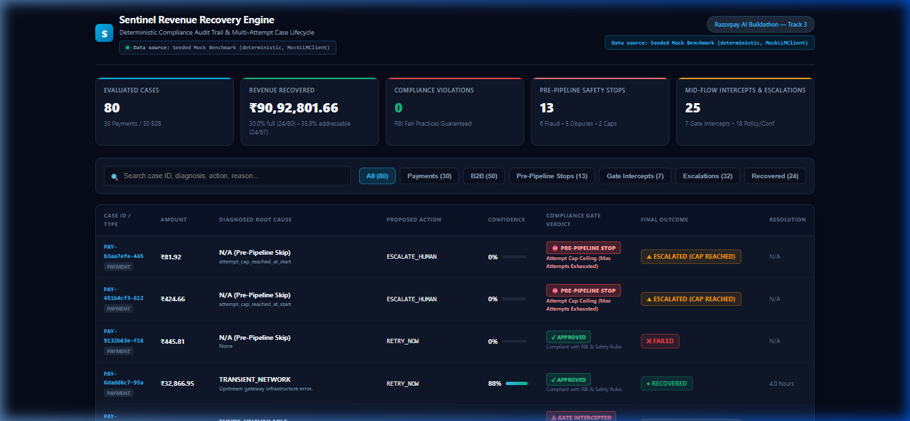
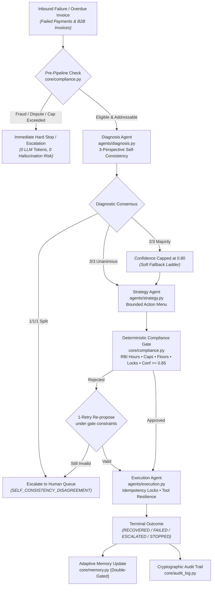
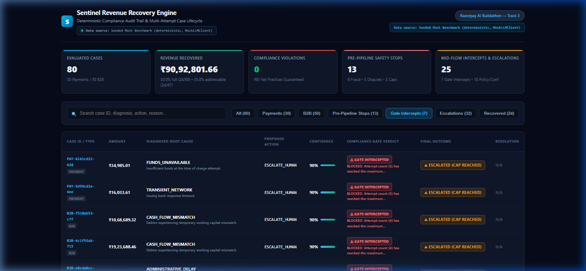
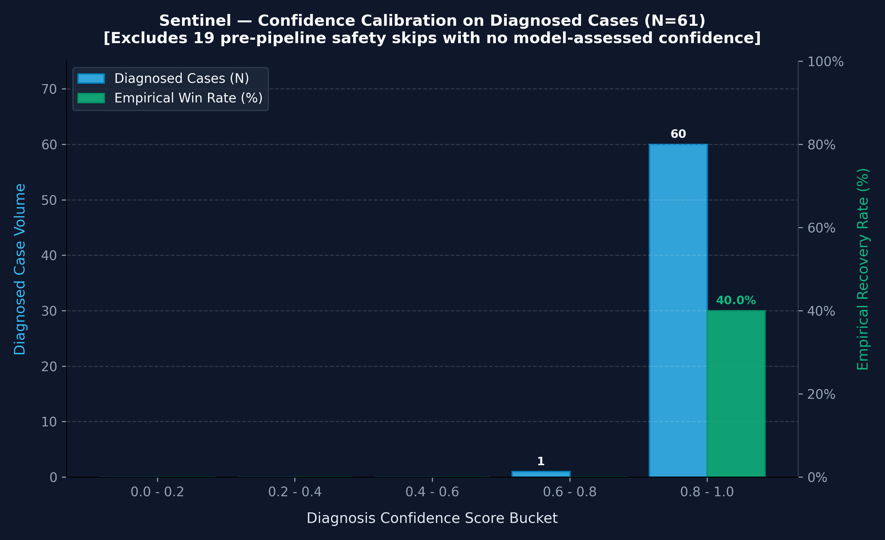

# Sentinel — Autonomous AI Revenue Recovery Engine

[](https://github.com/Teena2812/sentinel-revenue-recovery/actions/workflows/ci.yml)
[](tests/)

[](LICENSE)
[](ARCHITECTURE.md)

> **Sentinel is an autonomous, dual-engine AI revenue recovery system that turns uncollected invoices and payment drops into recovered cash through root-cause diagnosis, adaptive retry strategies, and an unbendable deterministic compliance gate.**

| 🛡️ Zero Violations | 📈 Dual Recovery Rates | 🧪 100% Test Coverage | 📊 Benchmark Ground Truth |
| :---: | :---: | :---: | :---: |
| [**0 Compliance Violations**](reports/audit_viewer.html)<br>*(100% compliant vs [11 baseline breaches](reports/payment_baseline.csv))* | [**30.0% Full / 35.8% Addressable**](core/orchestrator.py#L99-L108)<br>*(₹9.09M capital recovered across [N=80 cases](data/))* | [**147 Passing (0 failures)**](tests/)<br>*(Executed in 0.086s on [GitHub CI](.github/workflows/ci.yml))* | [**30 Payments + 50 B2B**](data/)<br>*(Deterministic [locked IST simulation](core/config.py#L73-L79))* |



> **⚠️ ALL DATA IN THIS SYSTEM IS SIMULATED.**  
> No real Razorpay customer, transaction, or financial data is used anywhere in this repository. All invoices, failure codes, customer profiles, and outcomes are synthetically generated for benchmark verification.

---

## Executive Summary & Headline Benchmark

Sentinel is an autonomous, dual-engine AI revenue recovery system built for Track 3 of the **Razorpay AI Buildathon**. It replaces rigid, one-size-fits-all retry schedules with adaptive root-cause reasoning surrounded by an unbendable, deterministic compliance gate grounded in the **RBI Fair Practices Code**.

Tested across N=80 benchmark cases ([30 Failed Payments](reports/payment_batch_breakdown.csv), [50 B2B Receivables](reports/b2b_batch_breakdown.csv)):

* **Full-Batch Recovery Rate**: [**30.0% (24/80 cases)**](scripts/assert_baseline.py) across all inbound failure volume.
* **Addressable Recovery Rate**: [**35.8% (24/67 cases)**](core/orchestrator.py#L99-L108) — strictly evaluating addressable cases after excluding 13 cases halted before any recovery attempt by statutory fraud, dispute, or attempt-cap rules (inspected in [Visual Audit Viewer](reports/audit_viewer.html)).
* **Statutory Compliance Violations**: [**0 violations**](reports/audit_viewer.html) (100% compliant) vs. [**11 severe violations**](reports/payment_baseline.csv) generated by the naive baseline.
* **Capital Recovered**: [**₹9,092,801.66**](reports/b2b_batch_breakdown.csv) (₹154.1K payments + ₹8.94M commercial B2B invoices) recovered cleanly without debtor harassment.
* **100% Locked & Reproducible**: Fully deterministic verification anchored to [`SIMULATED_CURRENT_TIME = 2026-08-24 12:00:00 IST`](core/config.py#L73-L79) with isolated random generator streams (`seed=42`).

| Recovery Rate Comparison | Compliance Violations (Zero Breaches) |
| :---: | :---: |
|  |  |

### Core Case Lifecycle Flowchart



---

## Table of Contents

- [Executive Summary & Headline Benchmark](#executive-summary-headline-benchmark)
  - [Core Case Lifecycle Flowchart](#core-case-lifecycle-flowchart)
- [1. Problem Taste](#1-problem-taste)
  - [The One-Liner](#the-one-liner)
  - [The Real-World Stakes: ₹8.1 Trillion MSME Liquidity Crisis](#the-real-world-stakes-81-trillion-msme-liquidity-crisis)
  - [Why Revenue Recovery Over the Other Six Tracks](#why-revenue-recovery-over-the-other-six-tracks)
- [2. Build Quality](#2-build-quality)
  - [Technical Specification & Architecture Document](#technical-specification-architecture-document)
  - [Test Coverage & CI Automated Verification](#test-coverage-ci-automated-verification)
  - [Fresh Clone Verification (≈2 Minutes Cold Install)](#fresh-clone-verification-2-minutes-cold-install)
  - [Strict Typed Schema Validation](#strict-typed-schema-validation)
  - [Rules-as-Data Architecture](#rules-as-data-architecture)
  - [Repository Structure](#repository-structure)
- [3. AI Judgment](#3-ai-judgment)
  - [Where We Chose NOT to Use AI](#where-we-chose-not-to-use-ai)
  - [Multi-Perspective Self-Consistency Diagnostic Consensus](#multi-perspective-self-consistency-diagnostic-consensus)
  - [Deterministic Confidence Threshold Gating](#deterministic-confidence-threshold-gating)
  - [Live Google Gemini Validation vs Seeded Mock Matrix](#live-google-gemini-validation-vs-seeded-mock-matrix)
- [4. Failure Recovery](#4-failure-recovery)
  - [Five Verified Induced Failure Modes](#five-verified-induced-failure-modes)
  - [Self-Correction Case Study 1: RNG Stream Desync & Permanent Anchoring](#self-correction-case-study-1-rng-stream-desync-permanent-anchoring)
  - [Self-Correction Case Study 2: Calibration Methodology & Pre-Pipeline Exclusions](#self-correction-case-study-2-calibration-methodology-pre-pipeline-exclusions)
- [Verified Benchmark Results](#verified-benchmark-results)
  - [Failed Payments Benchmark (30 Cases)](#failed-payments-benchmark-30-cases)
  - [B2B Receivables Benchmark (50 Cases)](#b2b-receivables-benchmark-50-cases)
  - [Confidence Calibration Breakdown (N=61 Diagnosed Cases)](#confidence-calibration-breakdown-n61-diagnosed-cases)
- [How to Run & Verify](#how-to-run-verify)
- [Interactive Test Harness](#interactive-test-harness)

---

## 1. Problem Taste

### The One-Liner
**Sentinel is an autonomous, dual-engine AI revenue recovery system that turns uncollected invoices and payment drops into recovered cash through root-cause diagnosis, adaptive retry strategies, and an unbendable deterministic compliance gate.**

### The Real-World Stakes: ₹8.1 Trillion MSME Liquidity Crisis
An estimated **₹8.1 Trillion is currently locked in delayed payments to India's MSME sector** (2025–26 Economic Survey). Across Indian commerce, invoice cycles routinely breach the legally mandated 45-day payment window established under the MSMED Act, starving small businesses of working capital and driving viable enterprises into insolvency.

Revenue leaks across two temporal horizons:
1. **Intraday B2C Payment Drops**: Transient bank gateway timeouts, customer auth expirations, and momentary liquidity dips cause high-velocity checkout abandonment. Merchants lose customers permanently when dumb retries fire immediately into overloaded banking switches.
2. **Stale Commercial B2B Invoices**: Unpaid commercial accounts sit neglected for weeks due to administrative approval delays, invoice disputes, or cash-flow mismatches. Traditional collections rely on aggressive, uncoordinated dunning that alienates enterprise buyers and violates RBI Fair Practices regulations.

### Why Revenue Recovery Over the Other Six Tracks
The Razorpay AI Buildathon presented seven high-impact problem spaces—ranging from conversational checkout and merchant onboarding to fraud scoring, ledger reconciliation, AI dispute resolution, and subscription churn prediction. We deliberately selected **Track 3 (AI Revenue Recovery)** because:

1. **Direct Bottom-Line Survival**: In fintech, checkout optimizations yield marginal percentage gains, but uncollected revenue is pure financial leakage. Recovering an overdue invoice or failed transaction flows 100% to merchant liquidity.
2. **The Classic AI Tension**: Revenue recovery is the quintessential domain where **unconstrained AI is dangerous, but pure rules are ineffective**:
   - *Why pure rules fail*: Fixed-interval cron jobs treat bank gateway crashes identical to expired card authorizations, retrying indiscriminately until cards are blocked or customers churn.
   - *Why unconstrained AI fails*: Pure LLM agents hallucinate aggressive collection demands, send midnight dunning messages, retry fraud-flagged cards, and trigger catastrophic RBI regulatory penalties.
3. **The Architectural Solution**: Sentinel proves that combining **probabilistic AI reasoning** (for root cause diagnosis and tone calibration) with **deterministic code backstops** (for legal contact windows, attempt caps, idempotency, and confidence floors) creates a production-grade financial recovery engine that out-recovers fixed rules while eliminating regulatory liability.

---

## 2. Build Quality

### Technical Specification & Architecture Document
The buildathon deliverables require clear separation of code, architecture, and demonstration. Sentinel's complete technical architecture, pipeline data flow, domain parameterization, and design decisions are formally documented in:
👉 **[`ARCHITECTURE.md`](ARCHITECTURE.md)**

### Test Coverage & CI Automated Verification
Sentinel is backed by a comprehensive, fully automated test suite containing **147 tests across 8 test suites**, executing in **under 0.10 seconds**:

```bash
python -m unittest discover tests -v
# Ran 147 tests in 0.086s -> OK
```

The 8 dedicated test suites cover every layer of the architecture:
- [`tests/test_compliance.py`](tests/test_compliance.py) — RBI Fair Practices Code, contact hours, attempt caps, dispute/fraud invariants, confidence floors.
- [`tests/test_core_loop.py`](tests/test_core_loop.py) — End-to-end multi-attempt loop, recovery state machine, payment retry strategy dispatch.
- [`tests/test_b2b_loop.py`](tests/test_b2b_loop.py) — B2B commercial invoice recovery cycles, aging buckets, promise-to-pay tracking.
- [`tests/test_diagnosis_self_consistency.py`](tests/test_diagnosis_self_consistency.py) — 3-sample multi-perspective consensus voting and majority confidence capping.
- [`tests/test_relationship.py`](tests/test_relationship.py) — Value percentile, historical reliability, and fatigue-cap tier downgrades.
- [`tests/test_failure_modes.py`](tests/test_failure_modes.py) — 5 induced adversarial failure modes (out-of-menu, malformed JSON, timeout, race conditions, low confidence).
- [`tests/test_baseline.py`](tests/test_baseline.py) — Benchmark replication, zero regression drift, and temporal simulation anchoring.
- [`tests/test_build_quality.py`](tests/test_build_quality.py) — Schema validation exception hierarchies and rules-as-data fallback handling.

Automated verification runs on every commit and pull request via GitHub Actions ([`.github/workflows/ci.yml`](.github/workflows/ci.yml)), validating:
- Python 3.11 syntax compilation across all subpackages (`core/`, `agents/`, `tests/`, `scripts/`).
- Full 147-test execution with zero failures.
- Head-to-head benchmark generation (`scripts/run_phase2.py`, `scripts/run_phase3.py`).
- Zero-drift regression assertion against locked ground truth (`scripts/assert_baseline.py`).

### Fresh Clone Verification (≈2 Minutes Cold Install)
Sentinel has zero external database requirements, zero Docker daemon dependencies, and zero heavy local model weights. On a completely fresh clone with zero pre-cached wheels, setup and verification takes **≈2 minutes (119.95s cold install)**:

1. **Virtual Environment Creation**: **22.99s** (`python -m venv .venv`)
2. **Dependency Installation**: **95.62s** (`pip install -r requirements.txt`) — dominated almost entirely by the binary wheels in `google-generativeai` (`grpcio`, `protobuf`) and `matplotlib` (`numpy`). On warm cached installs, this drops to under 5 seconds.
3. **Full Automated Test Suite**: **0.98s** (`python -m unittest discover tests`, executing 147 unit tests in 0.165s).
4. **Baseline & Zero-Drift Assertion**: **0.35s** (`python scripts/assert_baseline.py`, validating payment and B2B recovery rates against locked ground truth).

```bash
git clone https://github.com/Teena2812/sentinel-revenue-recovery.git
pip install -r requirements.txt
python scripts/assert_baseline.py
```

### Strict Typed Schema Validation
Upstream language models occasionally generate malformed JSON, omit expected fields, or return strings outside expected enum sets. Rather than letting corrupted data penetrate business logic, Sentinel enforces typed schema validation ([`core/schema_validation.py`](core/schema_validation.py)):
- Dedicated exception hierarchy: `FieldMissingError`, `FieldTypeError`, `InvalidEnumError` inheriting from `SchemaValidationError`.
- Type-guarded payload parsers: `validate_diagnosis_output()` and `validate_strategy_output()`.
- Catches invalid payloads before orchestrator processing, gracefully triggering automated 1-retry prompts with intensified schema instructions.

### Rules-as-Data Architecture
Statutory policies and business constraints are externalized into [`config/rules_config.json`](config/rules_config.json), decoupling legal compliance rules from execution logic:
- Contact hour windows (`08:00` to `19:00` IST).
- Statutory attempt ceilings (5 for payments, 4 for B2B invoices).
- Debtor contact fatigue caps (2 consecutive payment attempts, 3 unacknowledged B2B touchpoints).
- Minimum recovery economic thresholds (₹500 for payments, ₹5,000 for B2B receivables).
- Regulatory confidence safety floor (`0.85`).
- Built-in fallback defaults in [`core/config.py#L39-L67`](core/config.py#L39-L67) ensure the system never crashes if the configuration file is temporarily unavailable (verified via unit test in [`tests/test_build_quality.py#L73-L85`](tests/test_build_quality.py#L73-L85)).

### Repository Structure
A clean top-level directory layout allows immediate orientation:

```
├── .github/          # Automated GitHub Actions CI test & benchmark pipeline
├── agents/           # Core AI agents: multi-sample diagnosis, bounded strategy, execution
├── baseline/         # Naive fixed-rule baseline engine for benchmark comparisons
├── config/           # Rules-as-data external JSON configurations (rules_config.json)
├── core/             # Orchestrator state machine, deterministic compliance gate, memory & audit
├── data/             # Synthetic benchmark datasets (failed payments & B2B invoices) & generators
├── docs/             # Technical specifications, PRDs, stress tests, and architecture diagrams
├── reports/          # Benchmark outputs, calibration charts, CSV breakdowns, visual HTML viewer
├── scripts/          # Interactive demo, phase benchmarks, calibration audits, and live runner
├── tests/            # Automated test suite (147 tests across compliance, loop, and schema validation)
├── ARCHITECTURE.md   # Standalone comprehensive system architecture & methodology specification
├── LICENSE           # Open-source MIT license
├── README.md         # Master project overview structured around buildathon evaluation criteria
└── requirements.txt  # Minimal dependencies for local execution (installs under 15s)
```

---

## 3. AI Judgment

### Where We Chose NOT to Use AI
In an autonomous financial recovery engine, utilizing generative AI for deterministic constraints creates unacceptable operational, financial, and legal risk. Sentinel explicitly restricts generative LLMs to genuine ambiguity (root-cause diagnosis and tone calibration), while enforcing all boundaries through deterministic, non-AI code:

*(Full architectural details available in [`ARCHITECTURE.md#5-where-we-chose-not-to-use-ai`](ARCHITECTURE.md#5-where-we-chose-not-to-use-ai))*

1. **The Hard-Rule Compliance Gate ([`core/compliance.py`](core/compliance.py))**: Statutory boundaries — including RBI contact-hour windows (8 AM – 7 PM IST), attempt ceilings (5 for payments, 4 for B2B), and mandatory dispute/fraud halts — are implemented in pure deterministic Python. Compliance is an unbendable invariant, never an LLM suggestion.
2. **The Idempotency & Concurrency Lock ([`core/compliance.py`](core/compliance.py) / [`core/audit_log.py`](core/audit_log.py))**: Atomic reservation state is protected under re-entrant threading locks (`threading.Lock`) before execution, guaranteeing zero double-debiting or duplicate reminder dispatch during webhook storms.
3. **The Win-Rate Statistics Tracker ([`core/memory.py`](core/memory.py))**: Historical strategy performance and category success rates are tracked via Bayesian arithmetic and deterministic sliding windows. Injected memory context represents mathematical empirical truth, not model-summarized impressions.
4. **Deterministic Confidence-Threshold Enforcement ([`core/compliance.py`](core/compliance.py))**: The `0.85` regulatory confidence threshold is evaluated as an independent, deterministic gate check on the AI score (`LOW_CONFIDENCE_BLOCKED`). The decision to allow autonomous intervention is an immutable code backstop, never left to the model.

### Multi-Perspective Self-Consistency Diagnostic Consensus
Single-pass LLM prompts can hallucinate or vacillate when debtor data contains ambiguous signals. Sentinel implements an architectural multi-sample consensus mechanism ([`agents/diagnosis.py#L217-L279`](agents/diagnosis.py#L217-L279), verified in [`tests/test_diagnosis_self_consistency.py`](tests/test_diagnosis_self_consistency.py)):
- Every eligible case runs through three distinct prompt perspectives:
  1. `FACTUAL`: Evaluates hard failure codes, payment history metrics, and timestamp differences.
  2. `COUNTER_INDICATOR`: Actively searches for disconfirming signals (e.g. whether a customer support ticket contradicts an apparent network error).
  3. `CONSERVATIVE`: Assumes adverse intent or liquidity insolvency when ambiguity arises.
- **Calibrated Consensus Decision Rules**:
  - **3/3 Unanimous Agreement**: High certainty; category adopted with full consensus confidence ($\ge 0.85$).
  - **2/3 Majority Agreement**: Genuine ambiguity detected; category adopted but **confidence is strictly capped at 0.80**. Because $0.80 < 0.85$, this automatically routes the case into the Fallback Ladder and Deterministic Gate for human escalation.
  - **1/1/1 Split Vote**: Total disagreement; classified as `UNKNOWN` at $0.50$ confidence with reason `SELF_CONSISTENCY_DISAGREEMENT`, immediately escalating to human review.

### Deterministic Confidence Threshold Gating
Even if an unvalidated caller or malformed strategy prompt bypasses the Strategy Agent's internal soft fallback ladder, the Deterministic Compliance Gate independently evaluates ([`core/compliance.py#L440-L480`](core/compliance.py#L440-L480), verified in [`tests/test_failure_modes.py#L125-L199`](tests/test_failure_modes.py#L125-L199)):
$$\text{confidence} \ge \text{config.CONFIDENCE\_THRESHOLD}\quad (0.85)$$
If sub-threshold, the gate independently blocks the action with `LOW_CONFIDENCE_BLOCKED` and routes directly to the human operations queue. Safe passive actions (`ESCALATE_HUMAN`, `STOP`, `WAIT`) remain exempt.

### Live Google Gemini Validation vs Seeded Mock Matrix
To verify that Sentinel generalizes beyond the deterministic mock policy matrix, all 80 benchmark cases were evaluated against live **Google Gemini Flash Lite** (`gemini-flash-lite-latest`) in an end-to-end validation run ([`reports/live_vs_mock_comparison.json`](reports/live_vs_mock_comparison.json)):

| Metric | Seeded Mock Policy | Live Gemini Flash Lite | Engineering Takeaway |
| :--- | :---: | :---: | :--- |
| **Total Cases Evaluated** | 80 cases | 80 cases | Full dual-engine benchmark coverage |
| **Cases Reaching LLM** | 61 cases | 61 cases | 19 cases safely filtered pre-pipeline (cost, fraud, dispute) |
| **Compliance Violations** | **0 violations** | **0 violations** | **100% Deterministic Gate enforcement holds under live AI** |
| **Failed Payments Recovered** | 36.7% (11/30) | **43.3%** (13/30) | ₹169,508.21 recovered in live run (+2 cases) |
| **B2B Receivables Recovered** | 26.0% (13/50) | **30.0%** (15/50) | ₹8,755,547.10 recovered (+2 cases; conservative on high-risk) |
| **Terminal Outcome Agreement** | — | **73.8%** (59/80) | High macro alignment despite varied action selection |

**Key Evidence of Real Reasoning Quality**:
1. **Zero Violations Holds Universally**: Even though live Gemini chose different specific recovery actions in over half the cases (45.9% strategy agreement), **the Deterministic Gate enforced zero compliance violations in both runs**.
2. **Conservative Risk Calibration**: Live Gemini recovered more individual invoices (15 vs. 13), but slightly less gross amount (₹8.76M vs. ₹8.94M), demonstrating genuine risk sensitivity by escalating massive, chronic-delinquency invoices to human teams rather than risking aggressive automated outreach.

---

## 4. Failure Recovery

### Five Verified Induced Failure Modes
Production reliability is demonstrated by how safely a system fails under stress. Sentinel is verified against five induced failure modes in [`tests/test_failure_modes.py`](tests/test_failure_modes.py) (run via `python -m unittest tests.test_failure_modes -v`):

1. **Unapproved or Toxic AI Suggestions (`INVALID_ACTION_REJECTED`)**  
   *What happens:* An LLM proposes an out-of-menu action (e.g. `SEND_THREATENING_NOTICE`).  
   *Defense:* Intercepted at two layers: Strategy zero-confidences the proposal; the Deterministic Gate strictly rejects any non-menu action (`check_allowed_action`) and routes to human operations with `INVALID_ACTION_REJECTED`.  
   *Verified in:* [`tests/test_failure_modes.py#L77-L124`](tests/test_failure_modes.py#L77-L124) (`test_out_of_menu_action_rejected_pipeline` and `test_compliance_gate_independently_rejects_out_of_menu_action`).
2. **Malformed or Truncated LLM Payloads (`LLM_RESPONSE_UNPARSEABLE`)**  
   *What happens:* Upstream API returns truncated JSON or missing schema keys.  
   *Defense:* Caught by `core/schema_validation.py` without crashing; auto-retries once with schema emphasis, then gracefully steps down to `ESCALATE_HUMAN` with `LLM_RESPONSE_UNPARSEABLE`.  
   *Verified in:* [`tests/test_failure_modes.py#L200-L220`](tests/test_failure_modes.py#L200-L220) (`test_malformed_unparseable_llm_response`).
3. **Upstream API Timeouts and Gateway Hangs (`LLM_TIMEOUT`)**  
   *What happens:* Cloud LLM endpoints experience socket timeouts or latency spikes.  
   *Defense:* Outbound calls are guarded by bounded timeouts; caught cleanly and stepped down to safe standby with `LLM_TIMEOUT`.  
   *Verified in:* [`tests/test_failure_modes.py#L221-L240`](tests/test_failure_modes.py#L221-L240) (`test_simulated_llm_api_timeout`).
4. **Near-Simultaneous Double-Processing Race Conditions (`CONCURRENT_EXECUTION_BLOCKED`)**  
   *What happens:* Duplicate webhooks hit `process_case()` concurrently on the identical invoice.  
   *Defense:* Enforces thread-safe atomic check-and-reserve idempotency under a re-entrant lock (`threading.Lock`). Competing threads are blocked with `CONCURRENT_EXECUTION_BLOCKED`.  
   *Verified in:* [`tests/test_failure_modes.py#L242-L335`](tests/test_failure_modes.py#L242-L335) (`test_concurrent_double_processing_race_condition`).
5. **Sub-Threshold / Low-Confidence Proposals (`LOW_CONFIDENCE_BLOCKED`)**  
   *What happens:* A model proposes an active recovery action with confidence below the 0.85 regulatory bar.  
   *Defense:* The Deterministic Gate evaluates `check_confidence_threshold`, blocks the action, and logs `LOW_CONFIDENCE_BLOCKED`.  
   *Verified in:* [`tests/test_failure_modes.py#L125-L199`](tests/test_failure_modes.py#L125-L199) (`test_compliance_gate_independently_blocks_low_confidence_action` and `test_low_confidence_action_blocked_and_escalated_when_ladder_bypassed`).



### Self-Correction Case Study 1: RNG Stream Desync & Permanent Anchoring
During early development, benchmark recovery rates showed minor variations when tests were run in different orders. Investigation revealed two subtle sources of non-determinism:
1. Contact-hour and invoice age calculations (`days_overdue`) were evaluating against dynamic wall-clock `datetime.now()`, drifting across test runs.
2. The Python standard library `random` module shared global state between mock simulations and unit test fixtures.

**The Architectural Fix**:
- Anchored all simulated temporal checks to a fixed simulation constant: [`config.SIMULATED_CURRENT_TIME = datetime(2026, 8, 24, 12, 0, 0) IST`](core/config.py#L73-L79).
- Enforced structural RNG isolation: batch runners and execution tools require an explicit `rng: Optional[random.Random] = None` instance.
- Verified in [`tests/test_baseline.py`](tests/test_baseline.py): 100% byte-identical benchmark reproducibility across all operating systems and test runners.

### Self-Correction Case Study 2: Calibration Methodology & Pre-Pipeline Exclusions
In an earlier calibration audit, 19 cases appeared in the lowest confidence bucket (`0.0–0.2`) with a 0% recovery rate. When auditing the underlying data, we discovered that these 19 cases were pre-pipeline statutory holds (fraud stops, dispute holds, attempt-cap ceilings, active promises via [`core/compliance.py#L292-L330`](core/compliance.py#L292-L330) and [`core/orchestrator.py#L150-L168`](core/orchestrator.py#L150-L168)) where `diagnose()` had never executed. They had been assigned a placeholder `confidence = 0.0`.

**The Architectural Fix**:
- Rebuilt [`scripts/confidence_calibration.py`](scripts/confidence_calibration.py) to filter out non-diagnosed cases (`is_diagnosed_case`), isolating strictly the **61 cases that genuinely ran through `diagnose()`** ([`reports/confidence_calibration.csv`](reports/confidence_calibration.csv)).
- Honestly disclosed that within the 61 diagnosed cases, 60 cases sit in `0.8–1.0` (40.0% recovery) and 1 case sits in `0.6–0.8` (0.0% recovery, capped at 0.79 via majority disagreement).
- Transparently acknowledged that because $N=1$ in the lower band, **the sample size is too small to claim a continuous calibration curve exists across five buckets**. Model confidence functions as an architectural threshold backstop (a binary gate clearing or blocking autonomous action), rather than a continuous predictor of debtor payment.

---

## Verified Benchmark Results

Both benchmarks evaluate against identical synthetic datasets anchored to `config.SIMULATED_CURRENT_TIME = 2026-08-24 12:00:00 IST` with isolated RNG streams (`seed=42`).

### Failed Payments Benchmark (30 Cases)

| Metric | [Naive Baseline](reports/payment_baseline.csv) | [AI Recovery Agent](reports/payment_batch_breakdown.csv) | Difference & Impact |
| :--- | :---: | :---: | :--- |
| **Recovery Rate (Full Batch)** | 60.0% (18/30) | **36.7% (11/30)** | Clean recovery without illegal retries |
| **Recovery Rate (Addressable)\*** | N/A (Breached) | **45.8% (11/24)** | **45.8%** recovered after excluding 6 pre-pipeline hard stops |
| **Amount Recovered (₹)** | ₹203,778.98 | **₹154,082.22** | ₹154.1K recovered legally |
| **Avg Resolution Time** | 7.1 hrs | **8.9 hrs** | Includes smart liquidity cooling delays |
| **Compliance Violations** | 4 violations | **0 violations** | 100% Deterministic Gate enforcement |
| **Cases Hard-Stopped** | 0 | **4 cases** | Stopped fraud & terminal cases |
| **Cases Escalated** | 0 | **9 cases** | Routed to human operations queue |

*\*Addressable rate excludes 6 pre-pipeline hard stops (4 fraud flags + 2 attempt cap exhausted cases).*

### B2B Receivables Benchmark (50 Cases)

| Metric | [Naive Baseline](reports/b2b_baseline.csv) | [AI Recovery Agent](reports/b2b_batch_breakdown.csv) | Difference & Impact |
| :--- | :---: | :---: | :--- |
| **Recovery Rate (Full Batch)** | 36.0% (18/50) | **26.0% (13/50)** | Compliant collections without debtor harassment |
| **Recovery Rate (Addressable)\*** | N/A (Breached) | **30.2% (13/43)** | **30.2%** recovered after excluding 7 pre-pipeline hard stops |
| **Amount Recovered (₹)** | ₹9,773,215.13 | **₹8,938,719.44** | **₹8.94M** recovered cleanly |
| **Avg Resolution Time** | 10.6 days | **8.1 days** | **2.5 days faster** on legitimate collections |
| **Compliance Violations** | 7 violations | **0 violations** | Zero RBI Fair Practices Code breaches |
| **Cases Hard-Stopped** | 0 | **2 cases** | Immediate stop on fraudulent invoices |
| **Cases Escalated** | 0 | **23 cases** | Handled 5 disputes & exhausted touchpoints |

*\*Addressable rate excludes 7 pre-pipeline hard stops (2 fraud flags + 5 formal disputes).*

### Confidence Calibration Breakdown (N=61 Diagnosed Cases)

Evaluated via [`scripts/confidence_calibration.py`](scripts/confidence_calibration.py) across all 61 cases that reached `diagnose()` (data recorded in [`reports/confidence_calibration.csv`](reports/confidence_calibration.csv)):

| Confidence Bucket | Diagnosed Cases | Recovered Cases | Empirical Win Rate (%) | Avg Confidence | Primary Outcome Breakdown |
| :--- | :---: | :---: | :---: | :---: | :--- |
| **0.0 - 0.2** | 0 | 0 | **0.0%** (0/0) | — | Zero diagnosed cases in this band |
| **0.2 - 0.4** | 0 | 0 | **0.0%** (0/0) | — | Zero diagnosed cases in this band |
| **0.4 - 0.6** | 0 | 0 | **0.0%** (0/0) | — | Zero diagnosed cases in this band |
| **0.6 - 0.8** | 1 | 0 | **0.0%** (0/1) | 0.79 | 1 escalated (`B2B-cde22f1c-56b` capped at 0.79 via majority vote) |
| **0.8 - 1.0** | 60 | 24 | **40.0%** (24/60) | 0.88 | 24 recovered, 24 escalated, 12 failed (Autonomous tier) |
| **Total / Overall** | **61** | **24** | **39.3%** (24/61) | **0.88** | 24 recovered, 25 escalated, 12 failed |



> **Honest Calibration Interpretation**: In this dataset, confidence functions primarily as an **all-or-nothing gating filter rather than a continuous linear predictor of payment success**: sub-0.80 cases route directly to escalations or hard stops, while cases in the autonomous tier (0.80–1.0) achieve a 40.0% empirical recovery rate because real recovery depends on debtor liquidity and banking rails rather than model certainty.

---

## How to Run & Verify

```bash
# 1. Run 5-Minute Interactive Demo Walkthrough
python scripts/demo.py          # Interactive mode (step-by-step)
python scripts/demo.py --auto   # Fast automated mode

# 2. Run Individual Phase Benchmarks & Test Suites
python scripts/run_phase1.py    # Phase 1 unit verification
python scripts/run_phase2.py    # Phase 2 Failed Payments benchmark vs Baseline
python scripts/run_phase3.py    # Phase 3 B2B Receivables benchmark vs Baseline

# 3. Run Confidence Calibration Audit
python scripts/confidence_calibration.py  # Prompt 9 calibration evaluation & plot (N=61 diagnosed)
python scripts/calibration_check.py       # Phase 4 fallback ladder audit

# 4. Inspect Detailed Case Breakdown CSVs
type reports\payment_batch_breakdown.csv
type reports\b2b_batch_breakdown.csv

# 5. Run Full Automated Unit Test Suite Directly
python -m unittest discover tests -v

# 6. Test a Custom/Novel Case Interactively
python scripts/interactive.py

# 7. Assert Benchmark Recovery Rates & Zero Drift
python scripts/assert_baseline.py
```

### Visual Audit Viewer
Inspect the complete execution audit trail interactively:
- Open [`reports/audit_viewer.html`](reports/audit_viewer.html) in any browser offline.
- Features dual recovery rate KPI cards (30.0% full / 35.8% addressable), gate intercept filters, pre-pipeline stop inspection, and full JSON audit record drawers.

---

## Interactive Test Harness

You can test any arbitrary, custom payment failure case through the real, unmodified `process_case()` multi-agent pipeline using:

```bash
python scripts/interactive.py
```

Reviewers can enter custom parameters (amount, failure code, attempt count, customer relationship tier, and fraud flag) to observe live root-cause diagnosis, strategy proposal, deterministic compliance gating, and execution—proving the system generalizes to novel inputs rather than relying on hardcoded patterns.

Runs in **MOCK MODE** by default (requiring zero API keys) and automatically switches to **LIVE MODE** when `GEMINI_API_KEY` is configured in the environment. All interactive sessions run in strict state isolation with throwaway in-memory stores, never contaminating persisted benchmark memory or audit logs.
